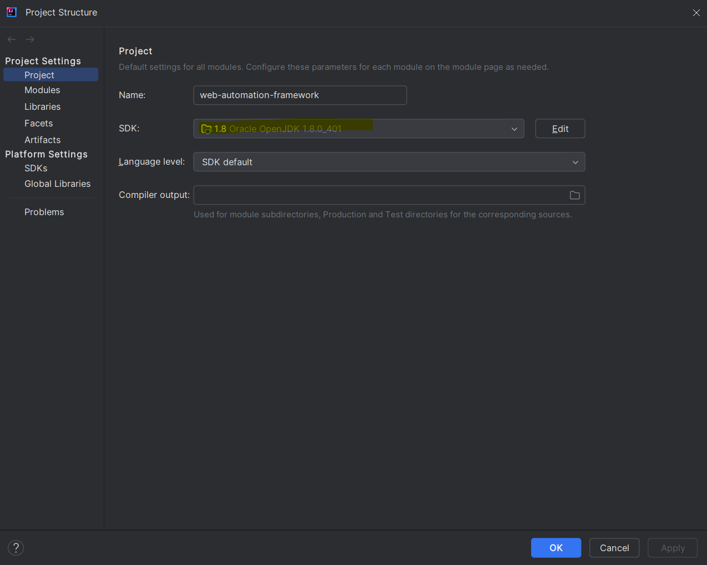
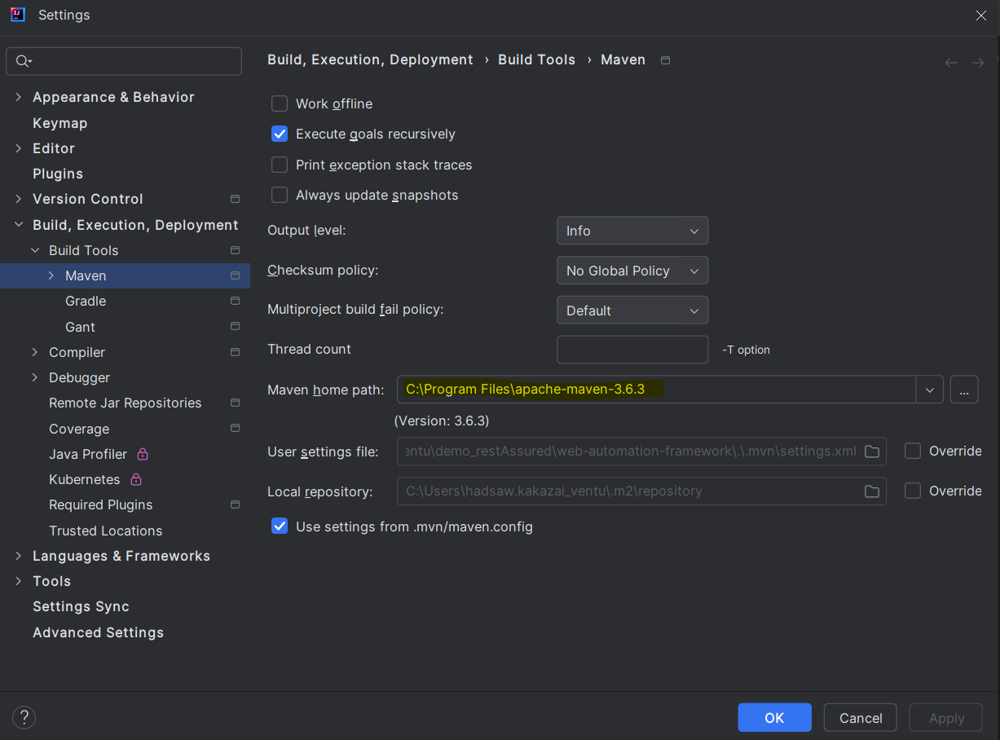
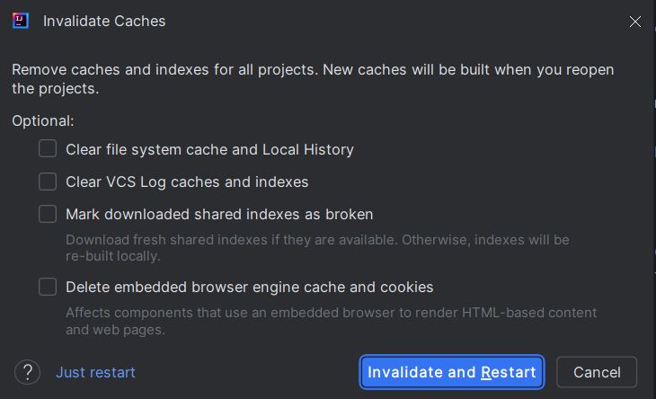

# Web Automation

###### Pre-requisites:
- Java JDK 8 should be installed by using the url https://www.oracle.com/java/technologies/javase/javase8-archive-downloads.html
- JAVA_HOME environment variable should be set
- Android Studio should be installed by using the url https://developer.android.com/studio
- ANDROID_HOME environment variable should be set
- Maven 3.6 version should be installed by using the url https://dlcdn.apache.org/maven/maven-3/3.6.3/binaries/
- Maven environment variable should be set
- Restart the system after completing the above steps

###### Steps to setup:
  - Clone repo: https://bitbucket.org/venturedive/web-automation-framework/src/master/
    - On GitHub.com, navigate to the main page of the repository. 
    - To clone your repository, click on the copy icon
    - Open Git Bash.
    - Change the current working directory to the location where you want the cloned directory.
    - Type git clone, and then paste the URL you copied earlier.
    - $ git clone https://github.com/YOUR-USERNAME/YOUR-REPOSITORY
    - Press Enter to create your local clone.
  - Create your own branch
    - Click on Branches Tab in Bitbucket
    - Click on Create branch
    - Type your branch name and click on create
  - Open project on IntelliJ
  - Open terminal and run command.
    - mvn clean test
    - git pull
  - Checkout your created branch
    - git checkout origin/yourbranchname

___
#
###### Pre-requisites (Ubuntu):

1) Java JDK 8 should be installed by using the following commands:

   - `sudo apt install openjdk-8-jdk`


2) Verify that the same version is installed

   - `java -version`


3) JAVA_HOME environment variable should be set
   - `export JAVA_HOME=/usr/lib/jvm/java-8-openjdk-amd64`

  
4) Verify that the variable is set
   - `echo $PATH`

    
5) Maven 3.6 version should be installed by using the following commands
   - `sudo apt install maven`
   - `sudo apt update`
  

6) To verify the installation, run
   - `mvn -version`
  

7) **_'settings.xml'_** file is required


8) Copy and paste the file **_'settings.xml'_** in **_'.m2'_** folder. You can find the **_'.m2'_** on Home by enabling **_'Show Hidden Files'_** option


9) Install Git from the following command
   - `sudo apt install git`
  
  
10) Restart the system after completing the above steps
 #
###### Steps to setup (Ubuntu):

- Clone repo: https://bitbucket.org/venturedive/web-automation-framework/src/master/
    - On Bitbucket.com, navigate to the main page of the repository.
    - To clone your repository, click on the copy icon
    - Go to the location where you want to clone the repository
    - Make a folder and open it.
    - Right click and open Terminal in that folder
    - Type git clone, and then paste the URL you copied earlier.
    - $ git clone https://github.com/YOUR-USERNAME/YOUR-REPOSITORY
    - Press Enter to create your local clone.
- Create your own branch
    - Click on Branches Tab in Bitbucket
    - Click on Create branch
    - Type your branch name and click on create
- Open project on IntelliJ
- Open terminal and run command.
    - mvn clean test
    - git pull
- Checkout your created branch
    - git checkout origin/yourbranchname

___


###### How to execute the framework:
- Go to web-automation-framework/testng.xml 
- Right click on the file
- Click on Run testng.xml 
- Or you can write this command on terminal : mvn test

###### Application Configuration File setup:
- Test Trail Integration: set LogTestRail = true  
- jira Integration: set LogJIRA = true
- Send Report through Email: SendEmailAfterExecution = True

###### How to set the Environment Variables (Ubuntu)
Steps to remove crucial variables from the ApplicationConfig.properties file and add them to system variables.

- Open the environment Variable file by executing the below command
  sudo -H gedit /etc/environment

- Add the following variables with Value:
```bash
- TestRailusername=value
- TestRailpassword=value
- sonaruser=value
- sonarpwd=value
- JiraUsername=value
- JiraPassword =value
- FromPassword=value
- dbUserName=value
- dbPassword=value
```
- save the file

Note*: If any variable contains # then do the following steps i.e 12#45

- Open environment Variable file
  sudo -H gedit /etc/profile

- Add the variable with Value
    - export sshDbPassword="12#45"

- Save the file

Note**: Restart the PC if the framework is not able to detect updated system variables

 ###### Steps to execute script:
  - Right click testng.xml and Run it
  - Wait for full execution
  - After execution is completed, open /reports/ExtentReport.html on Chrome browser to view results

###### Framework Understanding Video:

  https://drive.google.com/drive/folders/0BwmieK6G4SFUfm9jMVBGd3YtSlFMVExTV3ZVOTlrOUszcjBMUXRrX1ZGNkotNnowRnNHSGM

###### Setup of Percy:

- Login to percy.io
- Create New project on Percy
- Integrate Github or Bitbucket with your repository
- Get Percy token and export in local machine
- Execute test cases using "npx percy exec -- mvn test"

###### Code Structure:
1- all test cases are in _src/main/java/testcases_ 

2- all pages object are in _src/main/java/objects_

3- all classes i.e base class (hooks), main class etc are in _src/main/java/general_

4- db connection class define in package _com.venturedive:testrail-integration:10.3-SNAPSHOT/database.connection

5- all application configuration are in _src/main/resources

###### DataBase Connection

db =

dbUrl=

dbUserName=

dbPassword=2

dbPort =

1-for mysql db set **db=mysql** 

2-for postgres db set **db=postgres**

3-import venture dive jar in POM

4-initialize sonar db class  i.e **SonarDB dbconn= new SonarDB();**

5- use **dbconn.getResult(String query)** for select query return the resultSet

6- use **dbconn.executeQuery(String query)** for update query , delete and insert query

**13- Troubleshooting
- If you are facing errors while resolving the dependencies errors then perform the following steps
- Make sure you have the updated Setting.xml file, and you need to paste it in the .m2 folder present in the C:\User\User_name
- Make sure you have the same version of java and maven mentioned in the Readme file
- If you are unsure about the Java Version, you can click on the Project Structure -> Check the SDK version
- 
- If you are unable to find the .m2 folder, you can unhide it from properties
- Try to reload the maven project
- If Still the issue is unresolved then go settings, click on Build, Execution -> Click on Maven -> Select the path where maven is installed
- 
- Also in the menu bar click on File -> Click on Invalidate Cache -> Check All the option -> Click on Invalidate Cache and Restart
- 
- Perform the Invalidate Cache step two or three times, it will resolve all the Dependencies problem.


